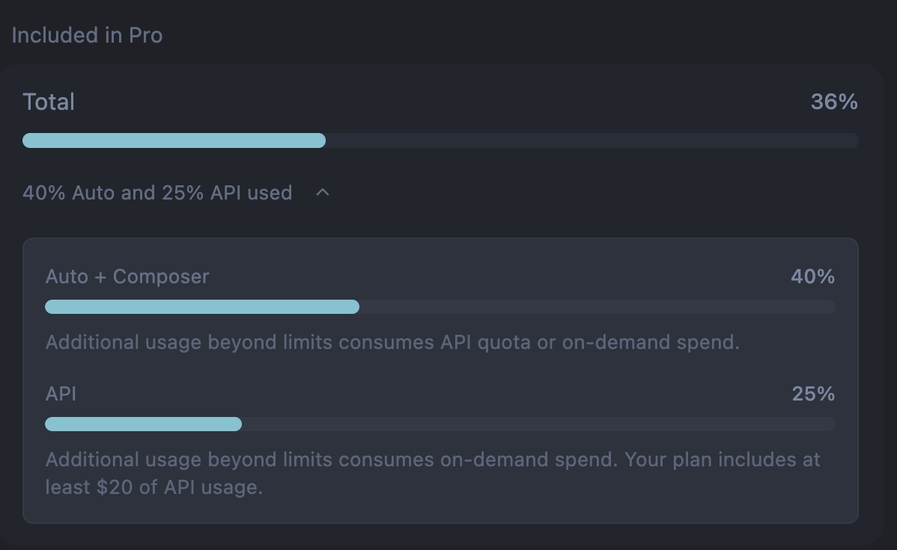

# Roadmate 路友

> Make Humans Talk Again

用 AI 读懂你的兴趣，用近场硬件帮你找到值得开口的人。

**演示**：[roadmate-sooty.vercel.app](https://roadmate-sooty.vercel.app/)

https://github.com/user-attachments/assets/6d8564bf-a930-4b53-9e84-3205e8c081e8

## 它是什么

Roadmate 是一个线下社交破冰的 Web 原型。

它模拟一枚可佩戴的圆形 NFC Tag：环形灯带提示匹配强度，圆屏给出靠近方向，两机重叠后完成配对。

产品想解决的不是「再做一个加好友 App」，而是：

> 在聚会、展会、旅途里，怎么在不掏手机的前提下，先发现谁和你聊得来。

当前用软件拟物验证完整闭环。硬件量产形态对齐「无实体键、NFC 靠近、环形 LED、圆形墨水屏」。

## 核心能力

| 能力 | 价值 |
| --- | --- |
| AI 兴趣推断 | 从近期发帖抽出可破冰的具体标签，而不是「音乐 / 旅行」这类空泛分类 |
| 近场硬件反馈 | 距离映射灯环频闪、Dock 放大、双向方向箭头，把相似度变成可感知信号 |
| 碰一碰配对 | 重叠后灯环充能确认，对齐真实 NFC 靠近仪式 |
| 轻社交延续 | 配对后走语音 + 表情，鼓励线下见面，而不是立刻加微信 |

## 谁会用、在什么场合

愿意线下认识同好，但不想尬聊或强行加好友的人。

典型场景是 Meetup、展会、共享空间、旅途驿站：周围都是陌生人，你不知道谁和你聊得来，也不想一直低头刷手机。

Roadmate 的做法是：硬件先筛「志趣相投」，见面只聊共同话题；Tag 挂在包或链上，余光读灯、走近读屏。

## 体验路径

完整 Journey 是四步：

```
兴趣推断 (/)  →  近场寻缘 (/playground)  →  碰一碰配对  →  轻社交 (/roadmates)
```

1. **Interest Lab**：粘贴帖子或拉取 X 时间线，推断兴趣标签，词云预览权重，保存画像。
2. **Playground**：拖动主控设备 RM-01 靠近可匹配对象，观察灯环、放大与方向箭头。
3. **碰一碰**：两机重叠，翠绿灯环充能约 1 秒，看到匹配分与共同话题。
4. **Roadmates**：进入路友列表与轻量对话原型。

更细的设备交互见 [设备 Playground 设计](docs/device-playground.md)。
推断流水线见 [兴趣推断设计](docs/interest-inference.md)。

## 设计亮点

### 1. 先筛同频，再开口

线下破冰难，不只是因为不会说话，更是因为不知道该找谁。

Roadmate 把「兴趣匹配」前置到见面之前。AI 从用户近期内容抽出具体可聊话题，设备再用灯光和方向把匹配变成近场信号。见面时，双方已经有共同话题，开口成本更低。

### 2. 圆形信标，而不是卡片上的一颗灯

早期外形更接近 iPod 卡片。单点 LED 在多人场景里识别度不够。

后来改成正圆金属 Tag + 360° 环形灯带。任意角度看起来都像一枚信标。配对确认也去掉假按键，改成重叠后灯环充能，对齐「无实体键、靠靠近完成确认」的量产想象。

### 3. 兴趣推断要可破冰，也要可归因

逐帖并行提取容易产出近义重复标签；滚动语料又容易丢掉「哪条帖子支撑了哪个兴趣」。

当前主路径是三阶段时间线：预处理保吞吐，全局合并控重复，再用帖级来源链计算时效权重。标签之后再做 embedding，驱动设备上的匹配分。

代价是多两次串行模型调用。换来的是标签更稳、更可评测。

### 4. 近场反馈要克制

画布上可能同时有多台设备。如果所有接近对象都闪灯，视觉噪声会盖过信号。

所以琥珀频闪只留给「最近一对」可匹配设备；有效距离收紧到约三倍设备直径；灯环频率用持久动画调速，随距离连续变化，而不是每帧重建。

Lab 负责「谁值得靠近」，Playground 负责「靠近时如何反馈」。两边通过画像与匹配分解耦。

## 架构概览

```
浏览器
  Interest Lab · Device Playground · Roadmates
  GSAP 动画 · Matter.js 物理 · localStorage 画像
        │
        ▼
Next.js API Routes
  推断流式进度 · Embedding · Twitter 代理
        │
        ▼
OpenRouter · twitterapi.io
```

浏览器侧完成交互与本地画像。服务端只做模型与第三方 API 代理，Key 由客户端传入，不落盘。

## 技术栈

| 层 | 选型 |
| --- | --- |
| 框架 | Next.js 16 App Router · React 19 · TypeScript |
| 样式 | Tailwind CSS v4 · 自定义拟物样式 |
| 动画 / 拖拽 | GSAP · Draggable |
| 物理 | Matter.js |
| 模型 | OpenRouter（默认 LLM + Embedding） |
| 数据源 | twitterapi.io（可选 X 拉帖） |

## 本地运行

需要 Node.js 18+，以及 [OpenRouter](https://openrouter.ai/) API Key。
X 拉帖模式另需 [twitterapi.io](https://twitterapi.io/) Key。

```bash
npm install
cp .env.example .env.local   # 可选
npm run dev
```

打开 [http://localhost:3000](http://localhost:3000)。

推荐 Demo 路径约 5–8 分钟：

1. 在 `/` 填入 OpenRouter Key，粘贴或导入帖子，推断并保存，进入 Playground。
2. 在 `/playground` 拖动 RM-01 靠近显示 `match XX%` 的设备，重叠完成配对。
3. 在 `/roadmates` 查看配对后的轻社交原型。

独立组件页：`/tag-cloud`（词云测试，无需 API）。

可选评测：

```bash
npm run bench:timeline
```

## 文档

| 文档 | 内容 |
| --- | --- |
| [设备 Playground 设计](docs/device-playground.md) | 外形演进、近场状态机、交互取舍 |
| [兴趣推断设计](docs/interest-inference.md) | 三阶段流水线、权重公式、评测方法 |

## Roadmap

已完成：兴趣推断、近场灯光与方向箭头、重叠配对、匹配成功转场、轻社交原型。

下一步：

- 近场音效
- 真实 NFC 确认
- 雷达扫描与更完整的见面仪式
- 圆形墨水屏刷新与残影的硬件对齐

## 开发说明

本项目用 Cursor Agent 辅助迭代原型与文档约定。开发过程按作业要求记录在 [interview.viberrate.com](https://interview.viberrate.com/)。

Cursor Pro 用量快照见 [`docs/cursor-usage/`](docs/cursor-usage/)：约 4 天、481 条事件、合计约 1.62 亿 tokens，Included in Pro 用量约 36%。明细：[usage-events CSV](docs/cursor-usage/usage-events-2026-07-10.csv)。



## 总结

Roadmate 的核心是：

> 用 AI 找出可破冰的共同兴趣，用近场硬件把匹配变成可感知信号，让线下开口变得自然。

具体来说：

- 推断侧追求具体、可归因、可评测的兴趣标签
- 设备侧用环形信标、方向箭头、重叠充能对齐无键 NFC 想象
- 近场反馈只服务最近一对，避免多人场景噪声
- 配对后走轻链接，鼓励真人见面

最终效果是一条可演示的完整闭环：读懂兴趣 → 靠近感知 → 碰一碰 → 轻社交。

## License

Private — 面试作业项目。
