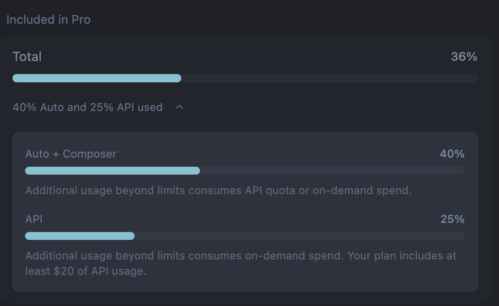

# Roadmate

> Make Humans Talk Again

Use AI to understand your interests, and near-field hardware to help you find people worth talking to.

**Demo**: [roadmate-sooty.vercel.app](https://roadmate-sooty.vercel.app/)

https://github.com/user-attachments/assets/6d8564bf-a930-4b53-9e84-3205e8c081e8

## What it is

Roadmate is a web prototype for offline social icebreaking.

It simulates a wearable circular NFC Tag: a ring light strip signals match strength, the round screen shows approach direction, and pairing completes when two devices overlap.

The product is not trying to be “yet another add-friends app.” It asks:

> At parties, exhibitions, and on the road — how do you discover who you click with, without pulling out your phone first?

Today the full loop is validated with software skeuomorphism. The production hardware vision aligns with “no physical keys, NFC proximity, ring LED, circular e-ink screen.”

## Core capabilities

| Capability | Value |
| --- | --- |
| AI interest inference | Extract concrete icebreaker tags from recent posts — not vague buckets like “music / travel” |
| Near-field hardware feedback | Distance maps to ring strobe, Dock scale-up, and bidirectional direction arrows — turning similarity into a perceptible signal |
| Tap-to-pair | After overlap, ring charge confirms pairing — aligned with a real NFC proximity ritual |
| Lightweight social follow-through | After pairing, voice + emoji encourage meeting in person — not immediately adding WeChat |

## Who uses it, and where

People who want to meet like-minded others offline, without awkward small talk or forced friend requests.

Typical settings: Meetups, exhibitions, shared spaces, travel hubs — surrounded by strangers, unsure who you click with, and unwilling to keep staring at a phone.

Roadmate’s approach: hardware first filters for “shared interests”; conversation focuses on common topics. The Tag hangs on a bag or chain — read the light in peripheral vision, read the screen as you approach.

## Experience path

The full Journey is four steps:

```
Interest inference (/)  →  Near-field discovery (/playground)  →  Tap-to-pair  →  Lightweight social (/roadmates)
```

1. **Interest Lab**: Paste posts or pull an X timeline, infer interest tags, preview weights in a word cloud, save a profile.
2. **Playground**: Drag owner device RM-01 toward matchable targets; watch the ring light, scale-up, and direction arrows.
3. **Tap-to-pair**: Overlap two devices; emerald ring charges for ~1 second; see match score and shared topics.
4. **Roadmates**: Enter the Roadmates list and lightweight conversation prototype.

Deeper device interaction: [Device Playground design](docs/device-playground.md).  
Inference pipeline: [Interest inference design](docs/interest-inference.md).

## Design highlights

### 1. Filter for resonance before speaking

Offline icebreaking is hard not only because people don’t know what to say — they often don’t know who to approach.

Roadmate moves “interest matching” earlier, before the meet. AI pulls concrete talkable topics from recent content; the device turns the match into a near-field signal via lights and direction. When people meet, they already share topics — opening a conversation costs less.

### 2. A circular beacon, not a single LED on a card

Early form factors were closer to an iPod card. A single LED is hard to recognize in crowded scenes.

Later: circular metal Tag + 360° ring light strip. From any angle it reads as a beacon. Pairing confirmation also dropped fake buttons in favor of overlap ring charge — aligned with the production idea of “no physical keys; confirm by proximity.”

### 3. Interest inference must icebreak and be attributable

Per-post parallel extraction tends to produce near-duplicate tags; rolling corpora often lose “which posts support which interest.”

The current main path is a three-stage timeline: preprocess for throughput, global merge to control duplicates, then a post-level source chain for recency weighting. Embeddings follow tags and drive the device match score.

The cost is two extra serial model calls. The payoff is more stable, more evaluable tags.

### 4. Near-field feedback should stay restrained

Many devices can be on the canvas at once. If every nearby object strobes, visual noise overwhelms the signal.

So amber strobing is reserved for the **nearest pair** of matchable devices; effective range is tightened to about three device diameters; ring frequency uses a persistent animation with speed control that changes continuously with distance — not rebuilt every frame.

Lab owns “who is worth approaching”; Playground owns “how to feedback while approaching.” The two stay decoupled via profile and match score.

## Architecture overview

```
Browser
  Interest Lab · Device Playground · Roadmates
  GSAP animation · Matter.js physics · localStorage profile
        │
        ▼
Next.js API Routes
  Inference streaming progress · Embedding · Twitter proxy
        │
        ▼
OpenRouter · twitterapi.io
```

The browser handles interaction and the local profile. The server only proxies model and third-party APIs; Keys are passed from the client and not persisted.

## Tech stack

| Layer | Choice |
| --- | --- |
| Framework | Next.js 16 App Router · React 19 · TypeScript |
| Styling | Tailwind CSS v4 · custom skeuomorphic styles |
| Animation / drag | GSAP · Draggable |
| Physics | Matter.js |
| Models | OpenRouter (default LLM + Embedding) |
| Data source | twitterapi.io (optional X post fetch) |

## Local development

Requires Node.js 18+ and an [OpenRouter](https://openrouter.ai/) API Key.  
X fetch mode also needs a [twitterapi.io](https://twitterapi.io/) Key.

```bash
npm install
cp .env.example .env.local   # optional
npm run dev
```

Open [http://localhost:3000](http://localhost:3000).

Recommended demo path (~5–8 minutes):

1. At `/`, enter an OpenRouter Key, paste or import posts, infer and save, then enter Playground.
2. At `/playground`, drag RM-01 toward devices showing `match XX%`, overlap to complete pairing.
3. At `/roadmates`, explore the post-pairing lightweight social prototype.

Standalone component page: `/tag-cloud` (word-cloud test, no API required).

Optional evaluation:

```bash
npm run bench:timeline
```

## Docs

| Doc | Contents |
| --- | --- |
| [Device Playground design](docs/device-playground.md) | Form evolution, near-field state machine, interaction trade-offs |
| [Interest inference design](docs/interest-inference.md) | Three-stage pipeline, weight formula, evaluation methods |

## Roadmap

Done: interest inference, near-field lights and direction arrows, overlap pairing, match-success transition, lightweight social prototype.

Next:

- Near-field audio
- Real NFC confirmation
- Radar scan and a fuller meet ritual
- Hardware alignment for circular e-ink refresh and ghosting

## Development notes

This project uses Cursor Agent to iterate on the prototype and documentation conventions. The development process is recorded as required for the assignment at [interview.viberrate.com](https://interview.viberrate.com/).

Cursor Pro usage snapshot: [`docs/cursor-usage/`](docs/cursor-usage/) — about 4 days, 481 events, ~162M tokens total, Included in Pro usage ~36%. Details: [usage-events CSV](docs/cursor-usage/usage-events-2026-07-10.csv).



## Summary

Roadmate’s core idea:

> Use AI to find icebreaker-worthy shared interests, and near-field hardware to turn matching into a perceptible signal — so offline conversation feels natural.

Concretely:

- Inference aims for concrete, attributable, evaluable interest tags
- The device side uses a ring beacon, direction arrows, and overlap charge — aligned with a keyless NFC vision
- Near-field feedback serves only the nearest pair, avoiding noise in multi-person scenes
- After pairing, keep a light link and encourage meeting in person

The result is a demoable end-to-end loop: understand interests → approach and sense → tap-to-pair → lightweight social.

## License

Private — interview assignment project.
