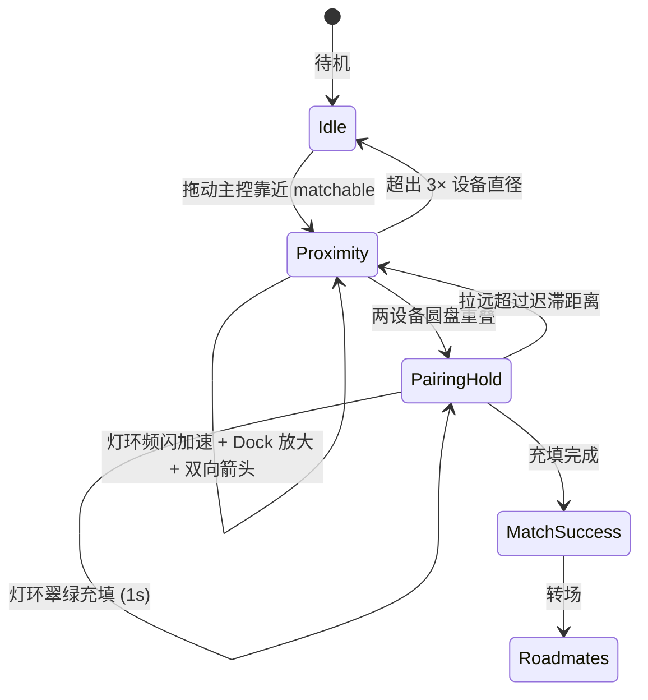

# Device Playground — 外形与交互设计

## 概述

Device Playground（`/`）是 Roadmate 近场社交硬件的 Web 交互原型。用户在画布上拖动「我的设备」（RM-01），靠近志趣相投的设备，通过 **Dock 放大**、**环形灯带频闪** 与 **墨水屏方向箭头** 感知匹配强度，重叠后可完成碰一碰配对仪式。

本文档记录设备**物理外形**与**灯光/屏幕交互**的三次重构历程、方案取舍，以及当前实现约定。代码入口见 `components/device-playground/`。

---

## 外形演进：三阶段

Playground 设备形态在 git 中经历了三次明确转折，对应从「拟物 iPod 卡片」到「AirTag 灵感圆形 Tag」的收敛过程。

### 三阶段对比

| | **v1 — iPod 卡片** | **v2 — 去按键简化** | **v3 — 圆形 Tag（当前）** |
|---|---|---|---|
| **代表提交** | `2e22ba9` | （与 v3 同批落地，`3ca8343`） | `3ca8343` → `57c3a5f` → 后续迭代 |
| **外形** | 88×148 px 竖向圆角矩形，金属渐变外壳 | 去掉底部滚轮占位，屏幕区向下延伸 | 120 px 正圆，金属 Tag 壳 + 内嵌圆屏 |
| **屏幕** | 顶部小矩形 LCD（`top:26 bottom:52`） | 同左，但不再为滚轮预留 52 px 底边 | 直径 85 px 圆形墨水屏（`DEVICE_SCREEN_D`） |
| **灯光** | 屏幕上方单点 LED（10 px 圆点 + 光晕） | 同左 | 屏外环形灯带（CSS mask 径向渐变环，`DEVICE_RING_OUTER`） |
| **按键** | 底部 `device-wheel` 滚轮装饰（36 px） | **移除** — 无交互、占空间、增 BOM | 无物理按键；配对靠重叠 + 灯环进度（未来 NFC 靠近确认） |
| **标签** | 屏内 mono 文案（label / match %） | 同左 | 屏外 sim label（`device-tag-sim-label`），屏内 ROADMATE / 箭头 / 成功态 |
| **设计参考** | iPod nano 1st gen 卡牌式 NFC 设备 | 功能裁剪后的卡片 | Apple AirTag 金属圆盘 + 圆形 e-ink |

### 演进时间线（git）

```
2026-07-04  2e22ba9  初版：iPod 卡片 + 顶部单点 LED + 滚轮装饰
            f591940  LED 频闪曲线、Dock、距离映射增强（外形未变）
2026-07-05  efbcff2  碰一碰配对仪式（长按确认按钮）
            …        Interest Lab 联调、叠放物理、成功转场
2026-07-06  8d3b390  琥珀色频闪、最近一对同步、主控视觉强化（仍为卡片）
            3ca8343  ★ 外形重构：圆形 Tag + 环形 LED + 方向箭头
            57c3a5f  墨水屏绿色调、RM 标签外置、尺寸放大
            ae8643f  配对确认按钮 → 灯环进度条
            8fb1a2b  匹配灯光有效距离收紧为 3 倍设备直径
            ca10c70  待机 ROADMATE 品牌字；箭头激活时隐藏
```

---

## 方案取舍

### 1. 为何从 iPod 卡片改为圆形 Tag？

**问题**：竖向卡片 + 顶部单点 LED 在「多人近场」场景下识别度不足——单点光在视觉上像普通指示灯，方向性弱，远处难以判断「哪台设备在回应我」。

**取舍**：

- **保留**：低功耗卡牌体积感、可拖拽叠放的 Matter 物理、主控设备（RM-01）cyan 光环区分。
- **放弃**：iPod 滚轮/Home 区域的拟物还原——Demo 中滚轮从未绑定交互，且占用约 36 px 底边 + 屏幕 `bottom:52` 留白，浪费有效显示面积。
- **引入**：AirTag 式正圆金属壳——**360° 可见的环形灯带**在人群中形成「信标」效果；圆形轮廓在任意角度都一致，适合挂在包/链上的硬件想象。

### 2. 为何去掉滚轮与 Home 键区域？

| 考量 | 说明 |
|---|---|
| **无功能** | 滚轮仅为 CSS 装饰（`.device-wheel`），不参与任何交互状态机 |
| **成本** | 额外结构件、装配面、内部空间占用，对 MVP 硬件无 ROI |
| **交互替代** | 近场确认改为 **设备重叠 + 灯环充能进度**（`ae8643f`）；量产后 **NFC 靠近** 即可完成碰一碰确认，无需实体键 |
| **屏幕收益** | 去掉底栏后，v3 将全部面积给 **圆屏 + 外环 LED**，信息密度更高 |

### 3. 为何从顶部单点 LED 改为环形灯带？

| 维度 | 单点 LED（v1） | 环形灯带（v3） |
|---|---|---|
| **视认性** | 点光源，侧面/远处易漏看 | 整圈闪烁，任意视角可见 |
| **语义** | 像「状态灯」 | 像「正在寻的 beacon / 雷达环」 |
| **配对反馈** | 需额外 UI（曾用 `MatchConfirmButton`） | 同一灯环可表达 **近场频闪**（琥珀）与 **配对进度**（翠绿充填，`LED_PAIRING_HOLD_COLOR`） |
| **实现** | `device-led-stack` 绝对定位于顶部 | `device-tag-led-ring` + `radial-gradient` mask，GSAP 动画 glow/core/track/progress 四层 |

**颜色语义**（`constants.ts`）：

- **琥珀 `#ffb020`**：主控 ↔ 可匹配设备近场频闪（与 UI 青/绿区分，暗壳上对比强）
- **翠绿 `#34d399`**：重叠配对倒计时，灯环充填进度

### 4. 圆形墨水屏与方向箭头

v3 新增 `MatchPointerArrow`（`3ca8343`）：当主控与**最近**的可匹配设备处于有效距离内，双方圆屏显示**实时旋转箭头**，指向对方方位。

**设计意图**：

- 解决「灯在闪但不知道往哪走」——频闪表达 *强度*，箭头表达 *方向*
- 配对成功后箭头隐藏，屏内切换为 match 分 + 共同话题（`MatchScoreCounter`）
- 待机态显示 **ROADMATE** 品牌字（`ca10c70`）；箭头可见时让位给寻路 UI

方位角由 `bearingBetweenCenters` 计算（0° = 上，顺时针），GSAP 平滑旋转（`smoothAngle`，除非 `prefers-reduced-motion`）。

---

## 交互设计理念

### 核心原则

1. **距离即信号** — 不依赖点击或按键；拖动主控设备即可驱动整套反馈链。
2. **双通道反馈** — 灯环（ peripheral / 余光）+ 圆屏（ focal / 精确），适应「人群中扫视」与「走近后确认」两种注意力。
3. **渐进式仪式** — 远 → 近 → 重叠 → 充能 → 成功屏 → Roadmates，每一步有独立视觉态，避免跳变。
4. **硬件可信** — Web 原型约束与量产想象对齐：无假按键、NFC 碰一碰、环形 LED、圆形 e-ink。

### 交互状态机（简图）



### 近场灯光（`useProximityEffects`）

- **有效距离**：`LED_MATCH_RANGE = DEVICE_W × 3`（`8fb1a2b` 收紧，避免全场乱闪）
- **仅最近一对**参与频闪同步（`8d3b390`），减少多人场景下的视觉噪声
- **频率映射**：`distanceToLedTimeScale` — 越远周期越长（~0.5 Hz），贴近时急促（~6 Hz）
- **强度映射**：`distanceToLedIntensity` — 光晕 opacity 随距离升高
- **实现约束**：持久 GSAP timeline + `timeScale` 调速，禁止每帧 kill/recreate（见 `AGENTS.md`）

### 碰一碰配对（`useMatchPairing`）

| 阶段 | 触发 | 视觉 |
|---|---|---|
| `idle` | — | 琥珀近场灯 / 待机 ROADMATE |
| `ready` | 中心距 < `PAIRING_OVERLAP_DISTANCE`（1× 直径） | 灯环切换配对态 |
| `holding` | 保持重叠 | 翠绿灯环进度 `holdProgress`（`MATCH_CONFIRM_HOLD_MS = 1000`） |
| `success` | 进度满 | 两机移中、confetti、屏显分数与话题 |
| 取消 | 距 > `PAIRING_OVERLAP_EXIT_DISTANCE`（1.08×，迟滞） | 回到近场态 |

**演进**：`efbcff2` 最初用屏外 **长按确认按钮**（`MatchConfirmButton`）；`ae8643f` 改为 **灯环充能**，与「去掉实体键、NFC 确认」的产品方向一致——用户只需 **持握靠近**，无需精准点击。

### Dock 放大

主控设备进入 `DOCK_RADIUS`（225 px）内的 matchable 设备时，目标设备 `scale` 升至 `DOCK_MAX_SCALE`（1.35），`transform-origin: center center`。与 LED 同步，形成「被吸引」的近场隐喻。

---

## 当前几何常量（v3）

| 常量 | 值 | 含义 |
|---|---|---|
| `DEVICE_D` | 120 px | 外圆直径 |
| `DEVICE_SCREEN_D` | 85 px | 内圆屏直径 |
| `DEVICE_SHELL_RING` | 17.5 px | 壳环宽度（屏与外壳之间） |
| `DEVICE_RING_OUTER` | 56 px | LED 环外径（扣除 bezel） |
| `DEVICE_LED_STROKE` | 3 px | 环 stroke 宽度 |
| `LED_MATCH_RANGE` | 360 px | 3 × 直径 |

主控设备：`OWNER_DEVICE_INDEX = 0`（RM-01），外圈 cyan halo（`device-tag-owner-halo`）。

---

## 与 Interest Lab 的关系

`6b1953b` 起，match 分由 Interest Lab 存入 localStorage 的 embedding 余弦相似度驱动（`matchScoring.ts`），替代 v1 随机 `match XX%`。外形重构不影响评分链路——**语义匹配**与**近场交互**解耦：Lab 负责「谁值得靠近」，Playground 负责「靠近时如何反馈」。

Journey 转场（`6877403`）将 Lab 推断结果注入主控屏，再进入 Playground，形成「兴趣 → 近场 → 配对」完整 Demo 路径。

---

## 后续硬件对齐（Phase 2/3）

| 已在原型验证 | 待量产 / Phase 2 |
|---|---|
| 环形 LED 距离频闪 | 真实 LED 驱动 IC + 低功耗策略 |
| 圆屏箭头寻路 | 圆形 e-ink 刷新率与残影 |
| 重叠 + 灯环进度配对 | **NFC 靠近** 确认，去掉 Web 长按/重叠模拟 |
| Matter 叠放拖拽 | 物理碰撞 → 触发配对 |
| 随机/embedding match 分 | 完整兴趣向量联动 |

---

## 参考提交索引

| 提交 | 摘要 |
|---|---|
| `2e22ba9` | 初版 iPod 卡片、顶部单点 LED、滚轮、`device-playground` 模块 |
| `f591940` | LED 周期/强度距离映射、Dock 逻辑重构 |
| `efbcff2` | 碰一碰配对、成功仪式、确认按钮 |
| `8d3b390` | 琥珀频闪、最近一对同步、主控 shell 强化 |
| `3ca8343` | **圆形 AirTag 外形、环形 LED、MatchPointerArrow** |
| `57c3a5f` | 墨水屏绿色、RM 外置标签、尺寸调大 |
| `ae8643f` | 确认按钮 → 灯环进度 |
| `8fb1a2b` | LED 有效距离 = 3 设备直径 |
| `ca10c70` | 待机 ROADMATE；箭头激活时隐藏 |
| `6b1953b` | Interest Lab embedding 匹配分 |
