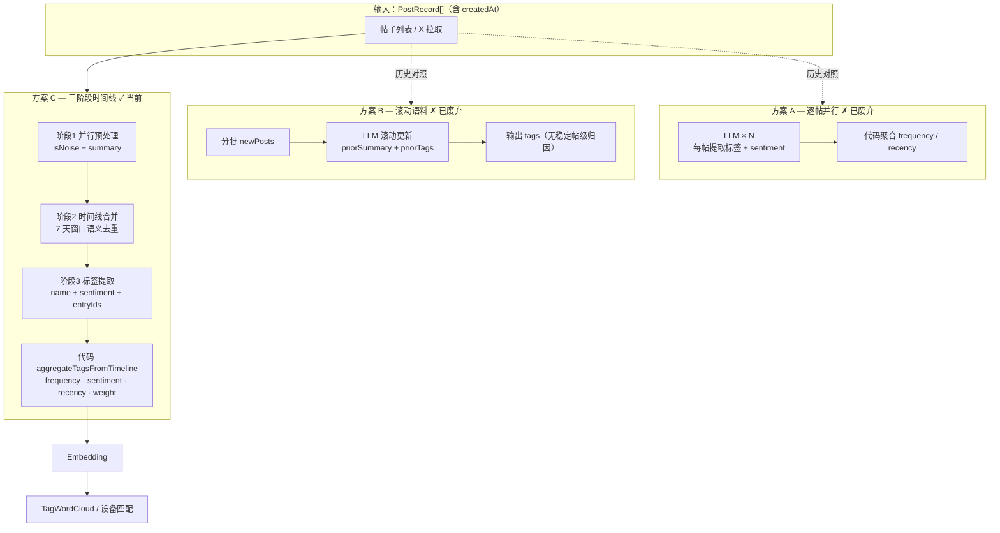

# Interest Lab — 推断与权重

## 方案演进与取舍

兴趣标签推断先后试过三种架构。Web UI 与 CLI benchmark（`npm run bench:timeline`）均已对齐**方案 C**；方案 A/B 代码保留在仓库中仅供对照，不再走主路径。

### 三方案对比


|                | 方案 A — 逐帖并行      | 方案 B — 滚动语料              | 方案 C — 三阶段时间线（当前）                |
| -------------- | ---------------- | ------------------------ | -------------------------------- |
| **LLM 调用**     | N 次（每帖 1 次，并行）   | ⌈N/5⌉ 次（分批 + prior 压缩）   | N 次预处理 + 2 次全局                   |
| **全局视角**       | ✗ 各帖孤立           | △ 有 prior，但时间被压成 summary | ✓ 完整时间线 + 语义合并                   |
| **时间归因**       | ✓ 每标签绑 `postId`  | ✗ 批次合并后难稳定归因到单帖          | ✓ `sourcePostIds` → `entryIds` 链 |
| **recency 计算** | ✓ 按帖 `createdAt` | ✗ 丢失或不稳定                 | ✓ 合并条目取最新帖时间                     |
| **可解释性**       | △ 有单帖中间态，缺合并逻辑   | ✗ 黑盒滚动压缩                 | ✓ 预处理 → 时间线 → 标签，链路清晰            |
| **上下文窗口**      | ✓ 单帖很小           | △ 靠 summary 滚动，长列表易漂移    | ✓ 阶段 1 压缩 + 阶段 2 合并控长            |
| **主要弊端**       | 重复/近义标签难合并       | 新鲜度权重不可靠                 | 多 2 次全局调用，调参面更广                  |


### 为什么选方案 C

1. **保留时间维度**：阶段 2 合并时 `createdAt` 取源帖最新值，`sourcePostIds` 贯穿到阶段 3 的 `entryIds`，代码侧 `frequency` / `recency` 可按 `INFERENCE.md` 公式稳定计算——这是方案 B 实测无法做到的。
2. **兼顾全局与局部**：阶段 1 并行保留单帖判噪能力（不丢方案 A 优点）；阶段 2/3 让 LLM 看到完整时间线，解决方案 A「各帖各提一套标签」的重复问题。
3. **可控的产品迭代面**：最重、最贴近「破冰话题」定位的 prompt 集中在阶段 3；阶段 1/2 偏工程预处理，可独立 A/B，不牵一发动全身。
4. **可评测的中间产物**：CLI `--verbose` 可打印每帖 `isNoise/summary`、合并后 `entries`、最终 `tags`，便于写 fixture 断言（`anyOf` / `forbidden` / `minSignalPosts`），不再只靠首页人工点测。

### 架构对比（Mermaid）




> 虚线表示仓库中仍保留实现（`extractTagsFromPosts`、`inferTagsFromCorpus`），但 `InterestLab.tsx` 与 `bench:timeline` 均走方案 C。

### 方案 C 的已知代价

- **延迟**：除 N 次预处理外，还有 2 次串行全局调用；长列表（50 帖）wall time 高于方案 A 的单轮并行。
- **阶段 2 合并质量依赖 LLM**：未合并时走 `fallbackTimelineEntries`（1 帖 1 条目），不会丢帖，但可能弱于理想语义合并。
- **全量重跑**：每次「推断并保存」不做增量跳过，帖文变化即重跑三阶段（换取结果可复现、避免 prior 漂移）。

---

## 流程概览（方案 C）

```
帖子输入 → 阶段1 并行预处理 → 阶段2 时间线合并 → 阶段3 标签提取 → 代码聚合 → Embedding → 词云展示
```


| 阶段          | LLM 职责                                | 代码职责                 |
| ----------- | ------------------------------------- | -------------------- |
| **1 预处理**   | 并行读单帖：判水贴 + 压缩摘要（1~2 句）               | 并发调度、过滤 noise        |
| **2 时间线合并** | 看完整时间线，相邻 7 天内语义相近帖合并为一条              | 合并时间取最新帖 `createdAt` |
| **3 标签提取**  | 从合并时间线输出破冰标签 + sentiment + entryId 归因 | 频次/新近度/weight、淘汰、排序  |


- **Embedding**：仅对聚合后的标签名生成向量（新标签惰性 embed）

输入模式：


| 模式    | 帖子来源                                                                                                 |
| ----- | ---------------------------------------------------------------------------------------------------- |
| 帖子列表  | 用户逐条添加，时间用「距今」（小时/天/周/月）；支持 `.txt` 批量导入/导出                                                           |
| X 用户名 | [twitterapi.io](https://twitterapi.io/dashboard) 拉取原创推文 → 与帖子列表相同的 `PostRecord` schema；可编辑、txt 导入/导出 |


## 阶段 1 — 单帖预处理

- 每条帖子单独调用 OpenRouter LLM（并发上限见 `LLM_CONCURRENCY`，默认 12）
- 输出：`{ isNoise, summary }`；水贴 `isNoise: true` 跳过后续阶段
- 长文压缩为核心要点（见 `TIMELINE_PREPROCESS_SUMMARY_MAX_CHARS`，默认 120 字）
- **设计意图**：并行保证吞吐；单帖粒度适合判噪，避免把职场碎碎念带入全局时间线

## 阶段 2 — 时间线合并

- 单次 LLM 调用，输入按时间排序的全部有效摘要（`formatPreprocessedForMergePrompt`）
- 相邻 **7 天**内语义高度相似的条目可合并（`TIMELINE_MERGE_WINDOW_DAYS`）
- 合并后 `createdAt` = 源帖中最新的时间；`sourcePostIds` 保留归因
- **设计意图**：在控住上下文长度的同时做「近时间窗内的语义去重」；跨 7 天以上的同主题帖**不合并**，以便 frequency 仍能反映跨期重复兴趣（见 fixture `cross-period-coffee`）
- **兜底**：LLM 返回空或非法 JSON 时，退化为 1 帖 1 条目（`fallbackTimelineEntries`）

## 阶段 3 — 标签提取

- 单次 LLM 调用，输入合并后的时间线（`formatTimelineForExtractPrompt`）
- 输出标签：`{ name, sentiment, entryIds }`；sentiment 0~1
- 产品向 prompt 集中在此阶段（`TIMELINE_TAG_EXTRACTION_PROMPT`）——破冰话题规则、禁提取项、具象化要求均在此调优
- `entryIds` 必须引用阶段 2 输出的 `entry.id`，供代码反查 `sourcePostIds` 做频次与新近度

## 推断触发

- 每次点击「推断并保存」均**全量重跑**三阶段流水线（不做增量跳过）
- 「清空标签」：清除聚合标签与各帖推断状态，帖子文本和时间保留

## 聚合

归因链：`TimelineTagDraft.entryIds` → `TimelineEntry.sourcePostIds` → `PostRecord.createdAt`。

同名标签按 `trim + lowercase` 合并，然后计算三维度：


| 维度            | 算法                                     |
| ------------- | -------------------------------------- |
| **frequency** | 纯频次：`sourcePostIds 展开计数 / 总帖数`（不与时间耦合） |
| **sentiment** | 各 entry 归因 sentiment 算术平均              |
| **recency**   | 以**最后一次出现**为准：`exp(-λ × 距今天数)`         |


时间衰减系数 **λ = 0.08**（约 30 天 → 0.09，90 天 → 0.001），**仅用于 recency**（及 weight 中的 `sentiment × recency`）。

### 最终 weight

```
weight = 0.40 × frequency + 0.20 × sentiment × recency + 0.40 × recency
```

- sentiment 乘以 recency：旧兴趣的情感贡献也随时间减弱
- 合并条目：frequency 按 `sourcePostIds` 展开计数；recency 取归因条目中最新的 `createdAt`
- 系数见 `constants.ts` 的 `WEIGHT_FACTORS`

### 过滤与输出

- 至少出现 **1** 帖才保留（`MIN_TAG_POST_COUNT`）
- **过期淘汰**：仅出现 1 次且最后出现超过 **60** 天 → 丢弃
- 按 weight 降序，取 top **20** 推断标签
- 用户自定义标签不参与聚合，默认 weight 0.55，追加在推断标签之后

## 词云大小

推断标签的 `weight` 传入 `TagWordCloud` 后，在**当前 batch 内 min-max 归一化**，再映射球体直径（compact 模式约 38~102px）。因此球大小是**相对排名**，不是 weight 绝对值线性对应像素。

自定义标签由滑轨权重（0.15~1.0）绝对映射尺寸。

## CLI 评测

自动化 benchmark 对齐 Web UI 同款管线：`parsePostsFromTxt` → `inferTagsFromTimeline` → `aggregateTagsFromTimeline`。

```bash
npm run bench:timeline                              # manifest 全部 case（10 个）
npm run bench:timeline -- --case multi-theme-user   # 单个 case
npm run bench:timeline -- --verbose                 # 打印三阶段中间结果 + 标签权重表 + 词云预览
npm run bench:timeline -- --json                    # 机器可读 JSON 输出
npm run bench:timeline -- posts.txt                 # 任意 roadmate-posts 格式文件
```

用例目录：`scripts/fixtures/corpus-cases/`（`manifest.json` + `*.posts.txt`）

每个 case 的 `expect` 支持：


| 字段                    | 含义               |
| --------------------- | ---------------- |
| `anyOf`               | 多组关键词，至少一组被某标签命中 |
| `forbidden`           | 禁止出现的泛化/噪音词      |
| `minTags` / `maxTags` | 推断标签数量区间         |
| `minSignalPosts`      | 阶段 1 后至少保留的有效帖数  |


输出含：**标签权重明细**（frequency / sentiment / recency / weight）与 **词云相对大小预览**（batch 内 min-max 归一化，与 UI 一致）。

历史对照脚本（方案 B，非主路径）：`npm run bench:corpus`

## 关键文件


| 文件                                                        | 职责                                                    |
| --------------------------------------------------------- | ----------------------------------------------------- |
| `server/timelineInference.ts`                             | 方案 C 三阶段 LLM 编排                                       |
| `server/timelineFormat.ts`                                | 阶段 2/3 prompt 格式化                                     |
| `prompts.ts`                                              | 三阶段 system prompt（含 `@deprecated` 方案 B 语料 prompt）     |
| `timelineUtils.ts`                                        | 推断结果应用、`timelineResultToInterestTags`                 |
| `tagUtils.ts`                                             | `aggregateTagsFromTimeline`、`computeTagWeight`        |
| `api/openrouter.ts`                                       | 浏览器端 `inferTagsFromTimeline`（NDJSON 流式进度）、`embedTags` |
| `app/api/interest-lab/openrouter/infer-timeline/route.ts` | 服务端推断 API                                             |
| `constants.ts`                                            | 并发、衰减 λ、权重系数、合并窗口等                                    |
| `InterestLab.tsx`                                         | Web UI 编排、profile 持久化（方案 C）                           |
| `scripts/benchmark-timeline-eval.ts`                      | 方案 C CLI benchmark                                    |
| `scripts/lib/timelineInferencePipeline.ts`                | CLI 共用管线封装                                            |


**已废弃（对照用）**：`server/corpusInference.ts`、`corpusUtils.ts`（方案 B）；`extractTagsFromPosts`（方案 A 薄封装）

## 帖子 txt 格式（roadmate-posts/1）

便于切换测试数据集，导入/导出均为 UTF-8 纯文本：

```
# roadmate-posts/1
@0h
刚看完一部 sci-fi 纪录片

@3d
周末试了新的 pour-over 豆子

@2w
Started learning Rust for embedded
```

- 每帖首行 `@<数量><单位>`：`h`/`d`/`w`/`m` 或 `@3 days`、`@2 周` 等
- 随后为正文，可多行；下一条 `@` 开头为新帖
- `#` 开头为注释；空行忽略
- 导入会**清空并替换**当前列表，同时清除 profile 中的推断标签（自定义标签保留）；导出不含推断标签，仅文本 + 相对时间
- X 模式「拉取帖子」会**合并**到当前列表（同 tweet id 保留已有推断结果）；切换用户名后拉取会清空列表
- 单次 **1 次 API 请求**（`MAX_TWEET_PAGES = 1`），最多 **20 条**原创推文（API 每页上限；转推过滤后可能更少）；免费 Key 约 0.2 QPS，遇 429/503 自动退避重试
- 帖子列表**不写入 localStorage**，刷新后需重新拉取或导入

## 调参入口

所有 magic number 集中在 `constants.ts`：

- `WEIGHT_FACTORS` — 三维权重比例
- `RECENCY_DECAY_LAMBDA` — 时间衰减陡峭程度
- `TIMELINE_MERGE_WINDOW_DAYS` — 时间线合并窗口
- `MAX_INFERRED_TAGS` / `STALE_TAG_DAYS` / `LLM_CONCURRENCY` 等

