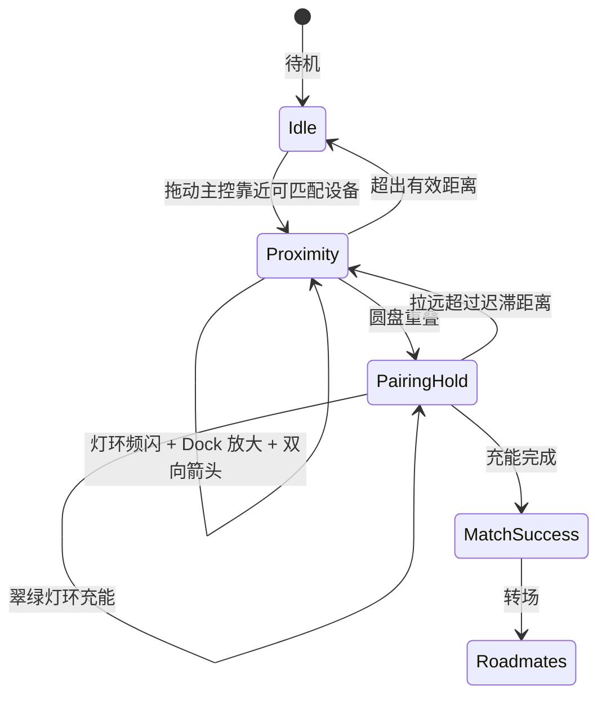

# 设备 Playground 设计

用 Web 拟物验证近场 Tag 的外形与交互：拖动主控靠近同频设备，靠灯环、方向箭头和重叠充能完成配对。

代码入口：`components/device-playground/`。

## 要解决的问题

线下场景里，用户需要在不掏手机的前提下回答两件事：

1. 附近有没有人和我聊得来？
2. 如果有，往哪边走？

Web 原型要同时验证硬件外形是否可信，以及近场反馈是否够清楚。

## 为什么朴素方案不够

最早做成竖向 iPod 卡片，顶部一颗状态灯。

这能演示「有匹配」。

但在多人画布上不够用：

- 单点灯像普通指示灯，远处难认，侧面容易漏看
- 假滚轮没有交互，却占掉屏幕和结构空间
- 屏外确认按钮像 App，不像「无实体键、靠靠近确认」的硬件

需要的是一枚任意角度都像信标的设备，以及一套只靠距离推进的反馈链。

## 核心设计

当前形态是圆形 Tag：

- 120 px 正圆金属壳
- 85 px 圆形墨水屏
- 屏外环形灯带
- 无物理按键

主控 RM-01 带青色外圈光环，便于在画布上辨认。

交互原则就四条：

1. **距离即信号**：拖动主控即可驱动整套反馈，不依赖点击。
2. **双通道反馈**：灯环给余光，圆屏给精确信息。
3. **渐进式仪式**：远 → 近 → 重叠 → 充能 → 成功，每一步有独立视觉态。
4. **硬件可信**：无假按键，对齐 NFC 靠近、环形 LED、圆形墨水屏的量产想象。

语义匹配和近场交互拆开：Interest Lab 决定「谁值得靠近」，Playground 决定「靠近时如何反馈」。两边通过画像与匹配分解耦。

## 关键机制

### 1. 外形：从卡片收敛到圆形信标

| 阶段 | 形态 | 灯光 | 按键 |
| --- | --- | --- | --- |
| v1 | iPod 竖向卡片 | 顶部单点 LED | 底部滚轮装饰 |
| v2 | 去掉滚轮的卡片 | 仍是单点 LED | 无 |
| v3（当前） | AirTag 式正圆 | 360° 环形灯带 | 无；靠重叠 + 灯环进度 |

保留了低功耗卡牌体积感和 Matter 叠放。放弃了无交互的滚轮拟物。引入环形灯带，是为了在人群中形成信标效果。

### 2. 近场灯光

拖动主控时，只有**最近一对**可匹配设备参与琥珀色频闪。

有效距离约三倍设备直径。越近，频率越高、光晕越强。

实现上使用持久 GSAP timeline，用 `timeScale` 调速。不要每帧销毁重建动画，否则频率无法随距离连续变化。

### 3. 方向箭头

灯环表达强度，箭头表达方向。

双方进入有效距离后，圆屏显示实时旋转箭头，指向对方。待机显示 ROADMATE 品牌字；箭头出现时让位。配对成功后箭头隐藏，改为匹配分与共同话题。

### 4. 碰一碰配对

两机圆盘重叠后进入充能：

1. 灯环切到翠绿
2. 保持重叠约 1 秒，进度沿灯环充填
3. 完成则成功转场；拉远超过迟滞距离则取消

曾用过屏外长按按钮。后来去掉，是为了让用户只做「持握靠近」，与量产 NFC 确认一致。

### 5. Dock 放大

主控进入约 225 px 范围时，目标设备放大到 1.35 倍，和灯环一起形成「被吸引」的近场隐喻。

## 交互状态机



颜色语义：

- 琥珀：近场寻缘
- 翠绿：配对充能

## 刻意不做的事情

- 不在原型里做假实体键。确认仪式只保留靠近与重叠。
- 不让所有接近对象同时闪灯。多人场景宁可漏闪，也不要噪声盖过信号。
- 不在 Playground 里重算兴趣语义。匹配分来自 Lab 的 embedding 与标签重叠。

几何与距离常量集中在 `components/device-playground/constants.ts`。

## 和其他模块的关系

```
Interest Lab 画像
      │
      ▼
matchScoring（embedding 余弦 + 标签重叠）
      │
      ▼
Playground 近场反馈与配对
      │
      ▼
Roadmates 轻社交原型
```

Journey 转场会把 Lab 结果注入主控，再进入 Playground，形成「兴趣 → 近场 → 配对」演示路径。

推断侧细节见 [兴趣推断设计](./interest-inference.md)。

## 后续方向

已在原型验证：环形 LED 距离频闪、圆屏箭头、重叠充能、Matter 叠放、embedding 匹配分。

下一步更贴近硬件：

- 真实 LED 驱动与低功耗策略
- 圆形墨水屏刷新与残影
- NFC 靠近确认，替代 Web 重叠模拟
- 物理碰撞触发配对

## 总结

这套设备设计的核心是：

> 把抽象匹配变成可感知的近场信号，同时让外形和确认方式对齐无键 NFC 硬件。

具体来说：

- 正圆 + 环形灯带解决多人场景里的视认性
- 灯环管强度，箭头管方向，重叠充能管确认
- 只服务最近一对，控制视觉噪声
- 语义匹配与近场反馈解耦，各自演进

最终效果是：用户拖动主控，就能完整体验「发现 → 靠近 → 配对」。
