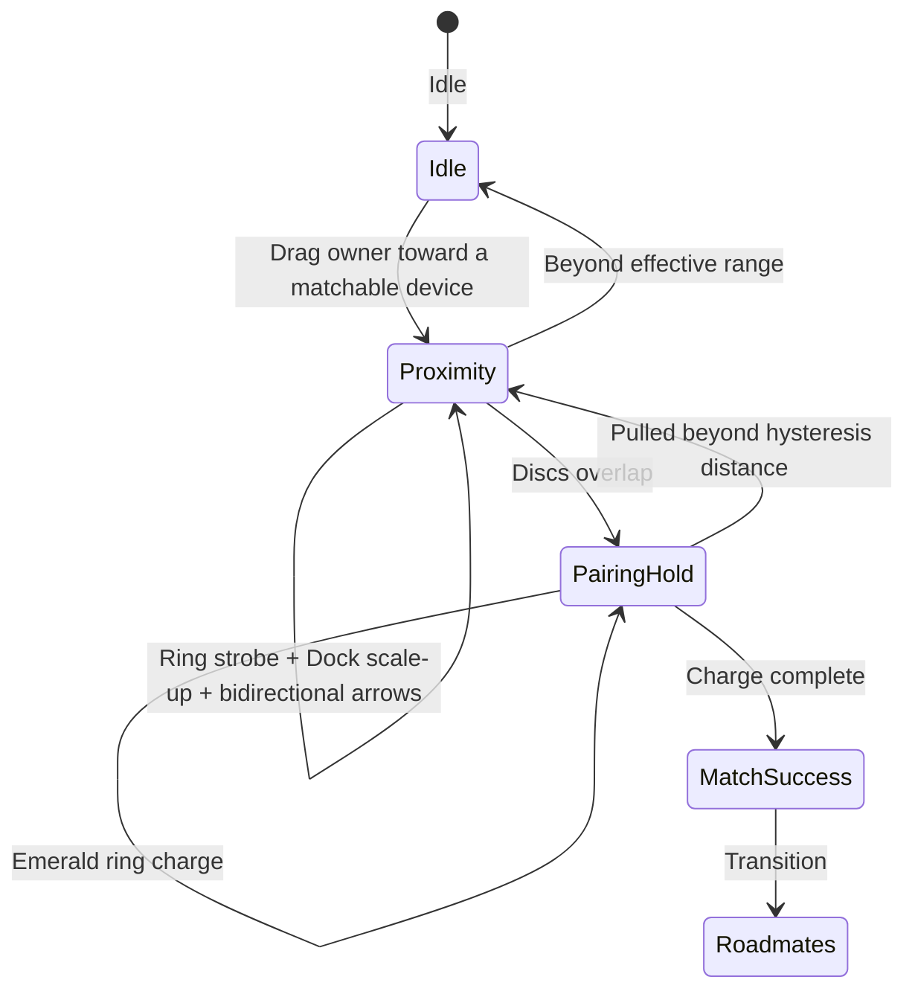

# Device Playground design

Use a web skeuomorph to validate near-field Tag form and interaction: drag the owner toward like-minded devices, and complete pairing via ring light, direction arrows, and overlap charge.

Code entry: `components/device-playground/`.

## Problem to solve

In offline settings, users need to answer two questions without pulling out a phone:

1. Is there anyone nearby I would click with?
2. If so, which way should I go?

The web prototype must validate both that the hardware form feels credible and that near-field feedback is clear enough.

## Why naive approaches fall short

The earliest form was a vertical iPod card with a single status LED on top.

That can demo “there is a match.”

But it is not enough on a multi-person canvas:

- A single LED reads like a generic indicator — hard to spot from afar, easy to miss from the side
- A fake scroll wheel has no interaction yet consumes screen and structure space
- An off-screen confirm button feels like an App, not “no physical keys; confirm by proximity” hardware

What is needed: a device that reads as a beacon from any angle, and a feedback chain driven only by distance.

## Core design

Current form is a circular Tag:

- 120 px circular metal shell
- 85 px circular e-ink screen
- Ring light strip outside the screen
- No physical buttons

Owner RM-01 has a cyan outer halo for easy recognition on the canvas.

Four interaction principles:

1. **Distance is the signal**: dragging the owner drives the full feedback set — no clicks required.
2. **Dual-channel feedback**: the ring serves peripheral vision; the round screen serves precise info.
3. **Progressive ritual**: far → near → overlap → charge → success, each step with its own visual state.
4. **Hardware credibility**: no fake buttons; aligned with NFC proximity, ring LED, and circular e-ink production vision.

Semantic matching and near-field interaction are split: Interest Lab decides “who is worth approaching”; Playground decides “how to feedback while approaching.” They stay decoupled via profile and match score.

## Key mechanisms

### 1. Form: from card to circular beacon

| Stage | Form | Lights | Buttons |
| --- | --- | --- | --- |
| v1 | iPod vertical card | Top single-point LED | Bottom scroll-wheel decoration |
| v2 | Card without scroll wheel | Still single-point LED | None |
| v3 (current) | AirTag-style circle | 360° ring light strip | None; overlap + ring progress |

Kept the low-power card-like volume feel and Matter stacking. Dropped the non-interactive scroll-wheel skeuomorph. Introduced the ring light strip so it reads as a beacon in a crowd.

### 2. Near-field lights

While dragging the owner, only the **nearest pair** of matchable devices participate in amber strobing.

Effective range is about three device diameters. Closer means higher frequency and stronger glow.

Implementation uses a persistent GSAP timeline with `timeScale` for speed control. Do not destroy and recreate the animation every frame — otherwise frequency cannot change continuously with distance.

### 3. Direction arrows

The ring expresses intensity; arrows express direction.

Once both enter effective range, round screens show real-time rotating arrows pointing at each other. Idle shows the ROADMATE brand wordmark; it yields when the arrow appears. After a successful pair, arrows hide in favor of match score and shared topics.

### 4. Tap-to-pair

When two discs overlap, charge begins:

1. Ring switches to emerald
2. Hold overlap for ~1 second; progress fills along the ring
3. On completion, success transition; if pulled beyond hysteresis distance, cancel

An off-screen long-press button was used earlier. It was removed so users only “hold and approach,” consistent with production NFC confirmation.

### 5. Dock scale-up

When the owner enters ~225 px range, the target device scales to 1.35×, forming a “being attracted” near-field metaphor together with the ring light.

## Interaction state machine


```mermaid
stateDiagram-v2
  [*] --> Idle: Idle
  Idle --> Proximity: Drag owner toward a matchable device
  Proximity --> Proximity: Ring strobe + Dock scale-up + bidirectional arrows
  Proximity --> PairingHold: Discs overlap
  PairingHold --> PairingHold: Emerald ring charge
  PairingHold --> Proximity: Pulled beyond hysteresis distance
  PairingHold --> MatchSuccess: Charge complete
  MatchSuccess --> Roadmates: Transition
  Proximity --> Idle: Beyond effective range
```

Color semantics:

- Amber: near-field discovery
- Emerald: pairing charge

## Deliberately not done

- Do not fake physical keys in the prototype. The confirm ritual keeps only approach and overlap.
- Do not strobe every nearby object at once. In multi-person scenes, prefer missing a strobe over letting noise drown the signal.
- Do not recompute interest semantics in Playground. Match score comes from Lab embeddings and tag overlap.

Geometry and distance constants live in `components/device-playground/constants.ts`.

## Relationship to other modules

```
Interest Lab profile
      │
      ▼
matchScoring (embedding cosine + tag overlap)
      │
      ▼
Playground near-field feedback and pairing
      │
      ▼
Roadmates lightweight social prototype
```

Journey transitions inject Lab results into the owner, then enter Playground — forming an “interest → near-field → pairing” demo path.

Inference details: [Interest inference design](./interest-inference.md).

## Next directions

Already validated in the prototype: ring LED distance strobing, round-screen arrows, overlap charge, Matter stacking, embedding match score.

Closer to hardware next:

- Real LED drive and low-power strategy
- Circular e-ink refresh and ghosting
- NFC proximity confirmation replacing web overlap simulation
- Physical collision triggering pairing

## Summary

The core of this device design:

> Turn abstract matching into a perceptible near-field signal, while aligning form and confirmation with keyless NFC hardware.

Concretely:

- Circle + ring light strip solve recognizability in multi-person scenes
- Ring owns intensity, arrows own direction, overlap charge owns confirmation
- Serve only the nearest pair to control visual noise
- Decouple semantic matching from near-field feedback so each can evolve

The result: the user drags the owner and fully experiences “discover → approach → pair.”
