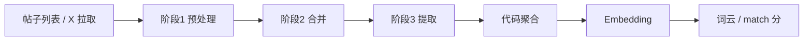

# 兴趣推断设计

从用户近期帖子抽出可破冰的具体兴趣标签，再经权重与 embedding，驱动设备匹配分和词云展示。

当前主路径是三阶段时间线。代码入口：`components/interest-lab/`。

## 要解决的问题

产品需要的不是「音乐 / 旅行」这类空泛分类，而是见面就能开口的具体话题。

例如「周末 pour-over」「嵌入式 Rust」「科幻纪录片」。

同时还要回答：

1. 这个兴趣出现得有多频繁？
2. 它有多新？
3. 哪几条帖子支撑了它？

没有归因链，就很难算时效权重，也很难评测「推断是否靠谱」。

## 为什么朴素方案不够

先后试过三种做法。

**方案 A：逐帖并行提取**

吞吐好，单帖归因也清楚。但各帖各自出标签，近义重复难合并，全局视角缺失。

**方案 B：滚动语料压缩**

能带着 prior 往前推，上下文更省。但批次合并后很难稳定回到单帖，新鲜度权重不可靠，中间过程也难断言。

真正需要的是：既保留帖级时间，又能在全局做语义去重，还能把最终标签追回到来源帖。

## 核心设计

当前方案 C 把工作拆成三段，再交给代码算权重：

```
帖子输入
  → 阶段 1 并行预处理
  → 阶段 2 时间线合并
  → 阶段 3 标签提取
  → 代码聚合 frequency / sentiment / recency / weight
  → Embedding
  → 词云 / 设备匹配
```

| 阶段 | 模型做什么 | 代码做什么 |
| --- | --- | --- |
| 1 预处理 | 判水贴，压缩成短摘要 | 并发调度，过滤噪声 |
| 2 时间线合并 | 近 7 天内语义相近的帖合并 | 合并时间取最新帖 |
| 3 标签提取 | 产出破冰标签、情感、来源条目 | 频次、新近度、权重、淘汰 |

产品向的破冰规则集中在阶段 3。前两段偏工程预处理，可以单独调，不牵一发动全身。

方案 A/B 代码仍保留对照，但 Web UI 与 `bench:timeline` 都走方案 C。

## 关键机制

### 1. 归因链

标签不直接绑帖子 ID 就算完。链路是：

```
标签 entryIds → 时间线条目 sourcePostIds → 帖子 createdAt
```

这样 frequency 和 recency 都由代码按真实时间算，而不是让模型口头估计新鲜度。

### 2. 时间线合并窗口

相邻 7 天内语义高度相似的内容可以合并，用来控上下文长度。

跨 7 天以上的同主题帖不合并。这样 frequency 仍能反映跨期重复兴趣，例如隔几周又提到咖啡。

模型合并失败时，退化为「一帖一条目」。不会丢帖，只是去重变弱。

### 3. 权重公式

同名标签先按小写合并，再算三维：

- **frequency**：来源帖展开计数 / 总帖数
- **sentiment**：各来源条目情感均值
- **recency**：以最后一次出现为准，`exp(-λ × 距今天数)`，λ = 0.08

最终：

```
weight = 0.40 × frequency + 0.20 × sentiment × recency + 0.40 × recency
```

sentiment 乘 recency，是为了让旧兴趣的情感贡献也随时间减弱。

过滤规则：

- 至少出现 1 帖才保留
- 只出现 1 次且超过 60 天 → 丢弃
- 按 weight 取 top 20

系数与窗口都在 `constants.ts`。

### 4. 全量重跑

每次「推断并保存」都重跑三阶段，不做增量跳过。

换来的是结果可复现，也避免滚动 prior 漂移。代价是长列表延迟更高。

### 5. Embedding 与词云

只对聚合后的标签名做向量。新标签惰性生成。

词云里的球大小是当前 batch 内 min-max 归一化后的相对排名，不是 weight 绝对值线性映射像素。自定义标签由滑轨权重绝对映射。

## 执行流



输入有两种：

- 帖子列表：可粘贴，也可按 `roadmate-posts/1` 文本导入导出
- X 用户名：经 twitterapi.io 拉原创推文，落到同一套帖子结构

帖子列表不写入 localStorage。刷新后需重新导入或拉取。画像只存标签与 embedding。

## 刻意不做的事情

- 不把方案 A/B 当主路径。它们只作对照。
- 不让模型直接输出最终 weight。频次和时效由代码算。
- 不做增量推断。先保证可复现和可评测。
- 不把帖子原文持久化到浏览器画像里。

## 和其他模块的关系

推断结果写入本地 profile 后，Playground 用 embedding 余弦和标签重叠计算 match 分。

设备侧不关心三阶段细节，只消费最终标签向量。拆开是为了让「谁值得靠近」和「靠近时如何反馈」可以分开迭代。

设备交互见 [设备 Playground 设计](./device-playground.md)。

## 评测

CLI 与 Web UI 共用同一条管线：

```bash
npm run bench:timeline
npm run bench:timeline -- --verbose
npm run bench:timeline -- --case multi-theme-user
```

用例在 `scripts/fixtures/corpus-cases/`。断言可检查关键词命中、禁词、标签数量、有效帖下限。

`--verbose` 会打印每帖噪声判断、合并条目、最终权重表，便于定位是哪一阶段出了问题。

## 调参入口

| 常量 | 作用 |
| --- | --- |
| `WEIGHT_FACTORS` | 三维权重比例 |
| `RECENCY_DECAY_LAMBDA` | 时间衰减陡峭程度 |
| `TIMELINE_MERGE_WINDOW_DAYS` | 合并窗口 |
| `MAX_INFERRED_TAGS` / `STALE_TAG_DAYS` / `LLM_CONCURRENCY` | 输出上限、过期淘汰、并发 |

编排与 prompt 主要在：

- `server/timelineInference.ts`
- `prompts.ts`
- `tagUtils.ts`
- `api/openrouter.ts`

## 总结

这套推断设计的核心是：

> 先保住帖级时间归因，再做全局语义去重，最后用代码算可复现的兴趣权重。

具体来说：

- 阶段 1 保吞吐和判噪
- 阶段 2 控重复和上下文长度
- 阶段 3 产出可破冰标签
- 代码侧负责 frequency / recency / weight，并接上 embedding

最终效果是：标签更具体、更可解释、更可评测，也能稳定驱动近场匹配。
